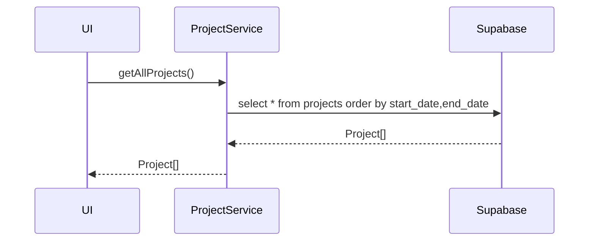
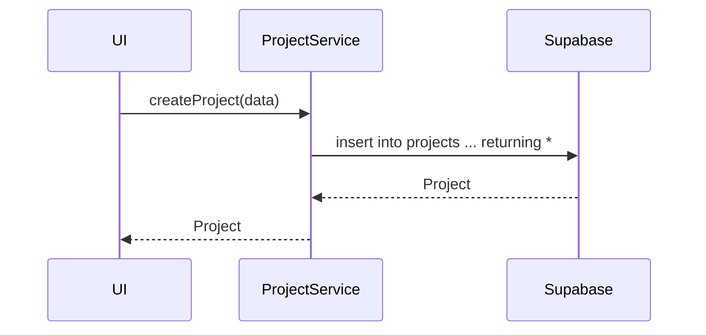
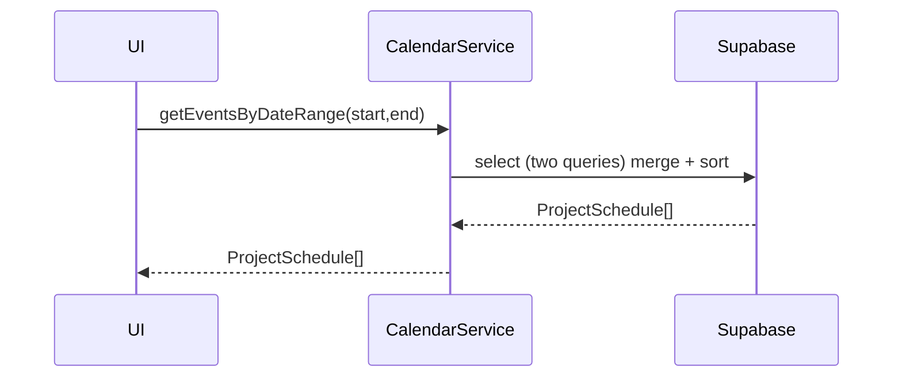
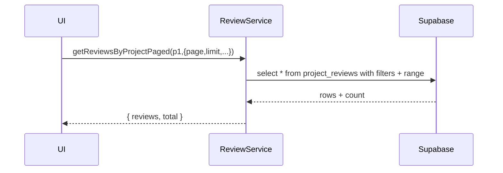

# DO NOT REMOVE THIS LINE. This MDX file documents service-layer API.

import { Meta, Canvas, Story } from "@storybook/blocks";

<Meta title="API/Endpoints" />

<Canvas>
  <Story name="Overview">
    <div style={{ padding: 16, fontSize: 14, color: "#444" }}>
      이 문서는 상단의 Docs 탭에서 전체 내용을 확인하세요.
    </div>
  </Story>
</Canvas>

# API Endpoints

이 문서는 내부 서비스 레이어(`src/services/*Service.ts`)를 기준으로, 기능과 입력/출력(데이터 형식)을 요약합니다. 모든 호출은 Supabase(PostgREST)를 통해 수행됩니다.

## 공통

- Base: 환경변수 `VITE_SUPABASE_URL`, `VITE_SUPABASE_ANON_KEY`
- 인증: 현재 익명 키 사용. 필요 시 RLS/Policy 적용 고려
- 타입 소스: `src/services/supabase.ts`

---

## ProjectService

### getAllProjects

```ts
// Signature
(): Promise<Project[]>
```

- 기능: 모든 프로젝트 조회 (시작일 asc, 종료일 asc)
- 응답 예시:

```json
[
  {
    "id": "p1",
    "title": "대시보드",
    "status": "in_progress",
    "images": [],
    "features": [],
    "challenges": [],
    "achievements": {},
    "detailed_description": {},
    "template_version": "v1",
    "user_id": "u1",
    "created_at": "2024-01-01T00:00:00Z",
    "updated_at": "2024-01-02T00:00:00Z"
  }
]
```



### createProject

```ts
// Signature
(projectData: Partial<Project>): Promise<Project | null>
```

- 요청 예시:

```json
{ "title": "신규 프로젝트", "status": "planned" }
```

- 응답 예시:

```json
{
  "id": "p2",
  "title": "신규 프로젝트",
  "status": "planned",
  "user_id": "u-default",
  "images": [],
  "features": [],
  "challenges": [],
  "achievements": {},
  "detailed_description": {},
  "template_version": "v1",
  "created_at": "2024-01-10T00:00:00Z",
  "updated_at": "2024-01-10T00:00:00Z"
}
```



### 기타 메서드

- getProject: 단일 프로젝트 조회 → `Promise<Project | null>`
- updateProject: 프로젝트 수정 → `Promise<Project | null>`
- deleteProject: 프로젝트 삭제 → `Promise<boolean>`
- getProjectTechnologies: 연결 기술 목록 → `Promise<Technology[]>`
- getAllTechnologies / createTechnology / updateTechnology / deleteTechnology
- setProjectTechnologies, getProjectsWithTechnologies, getProjectStats, getProjectTemplates

---

## CalendarService

### getEventsByDateRange

```ts
// Signature
(startDate: string, endDate: string): Promise<ProjectSchedule[]>
```

- 요청 예시:

```json
{ "startDate": "2024-05-01T00:00:00Z", "endDate": "2024-05-31T23:59:59Z" }
```

- 응답 예시:

```json
[
  {
    "id": "e1",
    "project_id": "p1",
    "title": "Kickoff",
    "type": "meeting",
    "start_time": "2024-05-02T09:00:00Z",
    "all_day": false,
    "status": "scheduled",
    "created_at": "2024-05-01T00:00:00Z"
  }
]
```



### createEvent

```ts
// Signature
(eventData: Omit<ProjectSchedule, 'id' | 'created_at'>): Promise<ProjectSchedule | null>
```

- 요청 예시:

```json
{
  "project_id": "p1",
  "title": "Design",
  "type": "task",
  "start_time": "2024-05-03T10:00:00Z",
  "all_day": false,
  "status": "scheduled"
}
```

- 응답 예시:

```json
{
  "id": "e2",
  "project_id": "p1",
  "title": "Design",
  "type": "task",
  "start_time": "2024-05-03T10:00:00Z",
  "all_day": false,
  "status": "scheduled",
  "created_at": "2024-05-03T09:00:00Z"
}
```

### 기타 메서드

- getAllEvents, getEventsByMonth, getEvent, updateEvent, deleteEvent, getEventsByProject, getEventStats, getTodayEvents, getWeekEvents

---

## ReviewService

### getReviewsByProjectPaged

```ts
// Signature
(projectId: string, options?): Promise<{ reviews: ProjectReview[]; total: number }>
```

- 요청 예시:

```json
{ "projectId": "p1", "options": { "page": 1, "limit": 10, "sortBy": "latest" } }
```

- 응답 예시:

```json
{
  "reviews": [
    {
      "id": "r1",
      "project_id": "p1",
      "review_type": "general",
      "content": "굿",
      "strengths": [],
      "improvements": [],
      "technical_feedback": {},
      "is_public": true,
      "is_featured": false,
      "created_at": "2024-05-04T00:00:00Z",
      "updated_at": "2024-05-04T00:00:00Z"
    }
  ],
  "total": 1
}
```



### createReview

```ts
// Signature
(data: Omit<ProjectReview, 'id' | 'created_at' | 'updated_at'>): Promise<ProjectReview | null>
```

- 요청 예시:

```json
{
  "project_id": "p1",
  "review_type": "general",
  "content": "좋아요",
  "strengths": ["속도"],
  "improvements": ["문서화"],
  "technical_feedback": {},
  "is_public": true,
  "is_featured": false
}
```

- 응답 예시:

```json
{
  "id": "r2",
  "project_id": "p1",
  "review_type": "general",
  "content": "좋아요",
  "strengths": ["속도"],
  "improvements": ["문서화"],
  "technical_feedback": {},
  "is_public": true,
  "is_featured": false,
  "created_at": "2024-05-05T00:00:00Z",
  "updated_at": "2024-05-05T00:00:00Z"
}
```

---

## BlogService

### getPublishedPosts

```ts
// Signature
(): Promise<BlogPost[]>
```

- 응답 예시:

```json
[
  {
    "id": "b1",
    "title": "도입기",
    "status": "published",
    "tags": ["storybook"],
    "slug": "intro",
    "user_id": "u1",
    "content": "...",
    "created_at": "2024-01-01T00:00:00Z",
    "updated_at": "2024-01-02T00:00:00Z"
  }
]
```

### createPost

```ts
// Signature
(postData: Omit<BlogPost, 'id' | 'created_at' | 'updated_at'>): Promise<BlogPost | null>
```

- 요청 예시:

```json
{
  "user_id": "u1",
  "title": "신규 글",
  "content": "초안",
  "status": "draft",
  "tags": ["react"],
  "slug": "new-post"
}
```

- 응답 예시:

```json
{
  "id": "b2",
  "user_id": "u1",
  "title": "신규 글",
  "content": "초안",
  "status": "draft",
  "tags": ["react"],
  "slug": "new-post",
  "created_at": "2024-02-01T00:00:00Z",
  "updated_at": "2024-02-01T00:00:00Z"
}
```

---

## UserService

### getUserByEmail

```ts
// Signature
(email: string): Promise<User | null>
```

- 요청 예시:

```json
{ "email": "developer@example.com" }
```

- 응답 예시:

```json
{
  "id": "u1",
  "email": "developer@example.com",
  "name": "Dev",
  "created_at": "2024-01-01T00:00:00Z",
  "updated_at": "2024-01-02T00:00:00Z",
  "social_links": {},
  "skills": [],
  "career": []
}
```

### createUser

```ts
// Signature
(userData: Omit<User, 'id' | 'created_at' | 'updated_at'>): Promise<User | null>
```

- 요청 예시:

```json
{
  "email": "dev@ex.com",
  "name": "Dev",
  "social_links": {},
  "skills": [],
  "career": []
}
```

- 응답 예시:

```json
{
  "id": "u2",
  "email": "dev@ex.com",
  "name": "Dev",
  "social_links": {},
  "skills": [],
  "career": [],
  "created_at": "2024-03-01T00:00:00Z",
  "updated_at": "2024-03-01T00:00:00Z"
}
```

---

## StorageService

### uploadPublic

```ts
// Signature
(bucket: string, file: File, pathPrefix?: string): Promise<string | null>
```

- 요청 예시(요약): 파일 업로드 `bucket = "public"`, `pathPrefix = "uploads"`
- 응답 예시:

```json
"https://<project>.supabase.co/storage/v1/object/public/public/uploads/1714690000000_img.png"
```

### deletePublicUrl

```ts
// Signature
(url: string): Promise<boolean>
```

- 요청 예시:

```json
{
  "url": "https://<ref>.supabase.co/storage/v1/object/public/public/uploads/a.png"
}
```

- 응답 예시:

```json
true
```

---

## 주요 타입 요약

- Project: 상태(status), 이미지(images[]), 템플릿 버전(template_version) 등 포함
- Technology: name, category, color
- ProjectSchedule: type('milestone'|'task'|'meeting'|'deadline'), all_day, status
- BlogPost: status('draft'|'published'|'archived'), tags[], slug
- ProjectReview: review_type, rating, strengths[], improvements[], technical_feedback

원본 타입: `src/services/supabase.ts` 참고
